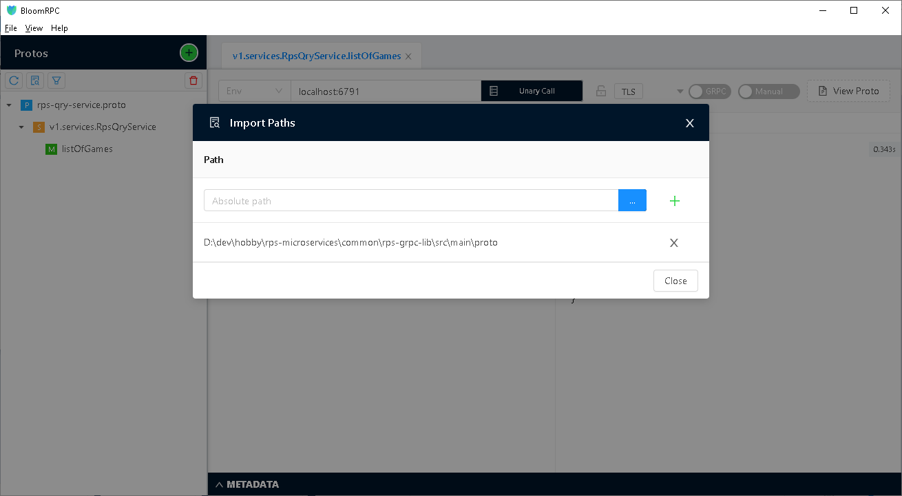
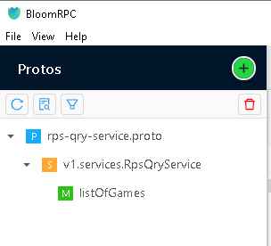
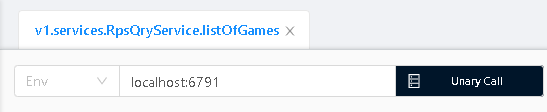
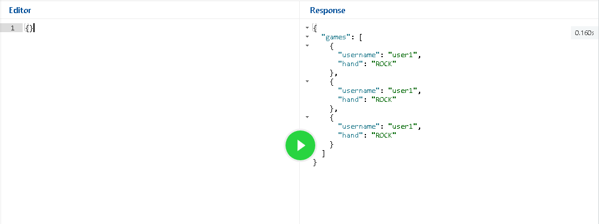

# Rock Paper Scissors game microservices
The Rock Paper Scissors game project provides infrastructure, REST and gRPC APIs for the Rock Paper Scissors game.
* [Rock Paper Scissors game command microservice](https://github.com/hokushin118/rps-microservices/tree/master/microservices/rps-cmd-service)
* [Rock Paper Scissors game query microservice](https://github.com/hokushin118/rps-microservices/tree/master/microservices/rps-qry-service)
* [Score command microservice](https://github.com/hokushin118/rps-microservices/tree/master/microservices/score-cmd-service)
* [Score query microservice](https://github.com/hokushin118/rps-microservices/tree/master/microservices/score-cmd-service)
### Prerequisites
* Java 11 or higher
### Technology stack
* [OpenJDK 11](https://openjdk.java.net/projects/jdk/11)
* [Maven 3.6.0](https://maven.apache.org)
* [Spring Boot 2.6.1](https://spring.io/projects/spring-boot)
* [Lombok 1.18.20](https://projectlombok.org)
* [MapStruct](https://mapstruct.org)
* [Apache ZooKeeper 3.5.9](https://zookeeper.apache.org)
* [Apache Kafka 2.8.1](https://spring.io/projects/spring-kafka)
* [MongoDB NoSQL 3.0](https://docs.spring.io/spring-data/mongodb/docs/current/reference/html)
* [MariaDB RDBMS 2.7.4](https://mariadb.org)
* [H2 Database Engine](https://www.h2database.com)
* [OpenAPI 3.0](https://springdoc.org)
* [gRPC framework 1.32.1](https://grpc.io/docs/languages/java/quickstart)
* [Hibernate Validator](https://hibernate.org/validator/)
* [Micrometer 1.8.0](https://spring.io/blog/2018/03/16/micrometer-spring-boot-2-s-new-application-metrics-collector)
* [JUnit 5.8.2](https://junit.org/junit5/docs/current/user-guide)
* [Mockito 3.9.0](https://site.mockito.org)
* [Spock 2.1](https://spockframework.org)
* [Apache Groovy 3.0.9](https://groovy-lang.org)
* [JaCoCo](https://www.jacoco.org/jacoco) - unit and integration test coverage
* [Flyway](https://flywaydb.org) - database version control 
* [Prometheus](https://prometheus.io) - metrics database
* [Grafana](https://grafana.com) - metrics visualization
* [ELK Stack](https://www.elastic.co) - log aggregation and monitoring in a centralized way
* [Redis](https://redis.io) - cache management

** H2 in-memory database engine is used for dev and it profiles only
### 1. Installation of Docker Desktop
* If [Docker Desktop](https://www.docker.com/products/docker-desktop) is not already installed navigate to the docker website download and install it on your local machine.
* To check if it is installed, you can simply run the command:
```
    > docker -v
```
* [Docker Compose](https://docs.docker.com/compose/install) is also required. To check if it is installed, you can simply run the command:
```
    > docker-compose -v
```
* If it is not already installed navigate to the [Docker Compose](https://docs.docker.com/compose/install) website and install it on your local machine.
* Check if Docker Swarm mode is active. To check it, you can simply run the command:
```
    > docker info
```
* If it is not already active, you can simply run the command:
```
    > docker swarm init
```
to activate it.
### 2. Deployment of the infrastructure
* Navigate to the root directory of the RPS Game project and then navigate to the docker directory.
```
    > cd docker
```
* Run "docker-compose -f docker-compose-general.yml -f docker-compose-kafka.yml -f docker-compose-metrics.yml -f docker-compose-elk.yml up -d" command to deploy necessary infrastructure on docker containers in the background.
```
     > docker-compose -f docker-compose-general.yml -f docker-compose-kafka.yml -f docker-compose-metrics.yml -f docker-compose-elk.yml up -d
```
* Verify that all necessary infrastructure and metrics containers are up and running.
```
    > docker-compose -f docker-compose-general.yml -f docker-compose-kafka.yml -f docker-compose-metrics.yml -f docker-compose-elk.yml ps
```
### 3. Building of the necessary common libraries
* Navigate to the common/rps-grpc-lib directory on your computer.
```
    > cd common/rps-grpc-lib
```
* And run "mvn clean install" in the root directory of the rps-grpc-lib project to generate Java model classes and service descriptions for microservices from proto3 models.
```
     > mvn clean install
```
* Navigate to the common/cqrs-es-framework directory on your computer.
```
    > cd common/cqrs-es-framework
```
* And run "mvn clean install" in the root directory of the cqrs-es-framework project to create jar file and install it to local .m2 repository.
```
     > mvn clean install
```
* Navigate to the common/rps-common-lib directory on your computer.
```
    > cd common/rps-common-lib
```
* And run "mvn clean install" in the root directory of the rps-common-lib project to create jar file and install it to local .m2 repository.
```
     > mvn clean install
```
### 4. Running the RPS game command microservice from the command line
* Navigate to the root directory of the microservice on your computer.
```
    > cd microservices/rps-cmd-service
```
* Run "mvn clean package -P<profile>" in the root directory to create the Rock Paper Scissors Game Command microservice app.
```
     > mvn clean package -Pdev
```
* Run microservice from the command line using spring boot maven plugin. Run "mvn spring-boot:run -Dspring.profiles.active=<profile>" in the root directory of the microservice to launch the Rock Paper Scissors Game Command microservice app.
```
     > mvn spring-boot:run -Dspring.profiles.active=dev
```
* Or run microservice from the command line. Run "java -jar target/rps-cmd-service.jar" in the root directory of the microservice to launch the Rock Paper Scissors Game Command microservice app.
```
     > java -jar target/rps-cmd-service.jar
```
* Open any browser and navigate to the microservice Open API 3.0 definition (REST API).
```
  http://localhost:8080/api/swagger-ui/index.html
```
### 5. Running the RPS game query microservice from the command line
* Navigate to the root directory of the microservice on your computer.
```
    > cd microservices/rps-qry-service
```
* Run "mvn clean package -P<profile>" in the root directory to create the Rock Paper Scissors Game Query microservice app.
```
     > mvn clean package -Pdev
```
* Run microservice from the command line using spring boot maven plugin. Run "mvn spring-boot:run -Dspring.profiles.active=<profile>" in the root directory of the microservice to launch the Rock Paper Scissors Game Query microservice app.
```
     > mvn spring-boot:run -Dspring.profiles.active=dev
```
* Or run microservice from the command line. Run "java -jar target/rps-qry-service.jar" in the root directory of the microservice to launch the Rock Paper Scissors Query microservice app.
```
     > java -jar target/rps-qry-service.jar
```
* Open any browser and navigate to the microservice Open API 3.0 definition (REST API).
```
  http://localhost:8081/api/swagger-ui/index.html
```
### 6. Running the Score command microservice from the command line
* Navigate to the root directory of the microservice on your computer.
```
    > cd microservices/score-cmd-service
```
* Run "mvn clean package -P<profile>" in the root directory to create the Score Command microservice app.
```
     > mvn clean package -Pdev
```
* Run microservice from the command line using spring boot maven plugin. Run "mvn spring-boot:run -Dspring.profiles.active=<profile>" in the root directory of the microservice to launch the Score Command microservice app.
```
     > mvn spring-boot:run -Dspring.profiles.active=dev
```
* Or run microservice from the command line. Run "java -jar target/score-cmd-service.jar" in the root directory of the microservice to launch the Score Command microservice app.
```
     > java -jar target/score-cmd-service.jar
```
* Open any browser and navigate to the microservice Open API 3.0 definition (REST API).
```
  http://localhost:8082/api/swagger-ui/index.html
```
### 7. Running the Score query microservice from the command line
* Navigate to the root directory of the microservice on your computer.
```
    > cd microservices/score-qry-service
```
* Run "mvn clean package -P<profile>" in the root directory to create the Score Query microservice app.
```
     > mvn clean package -Pdev
```
* Run microservice from the command line using spring boot maven plugin. Run "mvn spring-boot:run -Dspring.profiles.active=<profile>" in the root directory of the microservice to launch the Score Query microservice app.
```
     > mvn spring-boot:run -Dspring.profiles.active=dev
```
* Or run microservice from the command line. Run "java -jar target/score-qry-service.jar" in the root directory of the microservice to launch the Score Query microservice app.
```
     > java -jar target/score-qry-service.jar
```
* Open any browser and navigate to the microservice Open API 3.0 definition (REST API).
```
  http://localhost:8083/api/swagger-ui/index.html
```
### Useful links
For testing gRPC API (make sure that you are using correct grpc port for a profile), please consider the following options:
* [BloomRPC GUI client for gRPC](https://github.com/bloomrpc/bloomrpc) 
* [gRPCurl command-line tool](https://github.com/fullstorydev/grpcurl)
* [gRPC UI command-line tool](https://github.com/fullstorydev/grpcui) 

For testing REST API, you can also consider the following options:
* [Postman GUI client for REST](https://www.postman.com)  

For testing MongoDB, you can also consider the following options:
* [Compass GUI for MongoDB](https://www.mongodb.com/products/compass)
* [Robo 3T for MongoDB](https://robomongo.org)

To get an idea of HTTP/2 performance, you can follow the link below:
* [HTTP/2 Demo](http://www.http2demo.io)
### Microservice patterns used
* [Command Query Responsibility Segregation (CQRS)](https://microservices.io/patterns/data/cqrs.html) - [Event sourcing (ES)](https://microservices.io/patterns/data/event-sourcing.html)
* [Database per service](https://microservices.io/patterns/data/database-per-service.html)
* [Domain event](https://microservices.io/patterns/data/domain-event.html)
* [Service instance per container](https://microservices.io/patterns/deployment/service-per-container.html)
* [Health Check API](https://microservices.io/patterns/observability/health-check-api.html)
* [Application metrics](https://microservices.io/patterns/observability/application-metrics.html)
* [Messaging](https://microservices.io/patterns/communication-style/messaging.html)
### Useful Docker commands
* When we don't need infrastructure containers anymore, we can take down containers and delete their corresponding volumes using the down command:
```
     > docker-compose -f docker-compose-general.yml -f docker-compose-kafka.yml -f docker-compose-metrics.yml -f docker-compose-elk.yml down -v
```
### BloomRPC Configuration
* Launch the BloomRPC application.
* Add path to proto folder of the rps-grpc-lib project to BloomRPC paths:
  

* Add testing service definition proto file:
  


* Add gRPC server url and port:



* Query the gRPC service:


### Apache Bench for microservice performance testing
* Download [Apache Bench](https://httpd.apache.org/download.cgi) tool on your computer. 
* Launch CLI and type ab -n 1000 -c 10 http://<url of the microservice>:<port of the microservice>/contect path and endpoint/ to benchmark microservice. 
```
> ab -n 1000 -c 10  http://127.0.0.1:8083/api/v1/scores
```
-n 1000 is the number of requests to perform for the benchmarking session. The default is to just perform a single request which usually leads to non-representative benchmarking results.
-c 10 is the concurrency and denotes the number of multiple requests to perform at a time. Default is one request at a time.