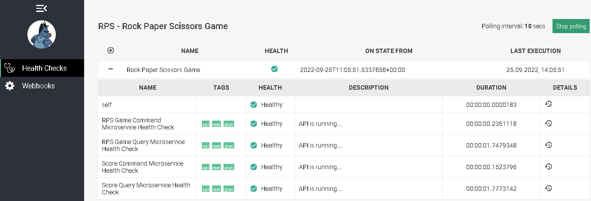

# Health check microservice

The Health check microservice provides health monitoring of the RPS game microservices.

### Prerequisites

* Docker Desktop
* .NET 6.0
* (Optional) Visual Studio 2022 17.0 or later
* (Optional) Visual Studio Code

### Technology stack

* [.NET 6](https://www.microsoft.com/net/download)

### Preconditions for running microservice

* Make sure you have the infrastructure is up and running before you run Health check microservice.
* If not navigate to the root directory of the project on your computer and run the docker compose command below to
  deploy necessary infrastructure on docker containers in the background.

```
     > docker compose -f docker-compose-general.yml -f docker-compose-kafka.yml -f docker-compose-metrics.yml -f docker-compose-elk.yml -f docker-compose-api.yml up -d
```
### Health Checker endpoint
If we navigate to the:
```
     > localhost/status/hc
```
we should see the RPS game microservices health check information in the json format.
### Health Checker UI
If we navigate to the:
```
     > localhost/status/hc-ui 
```
we should see a health checker user interface below:


